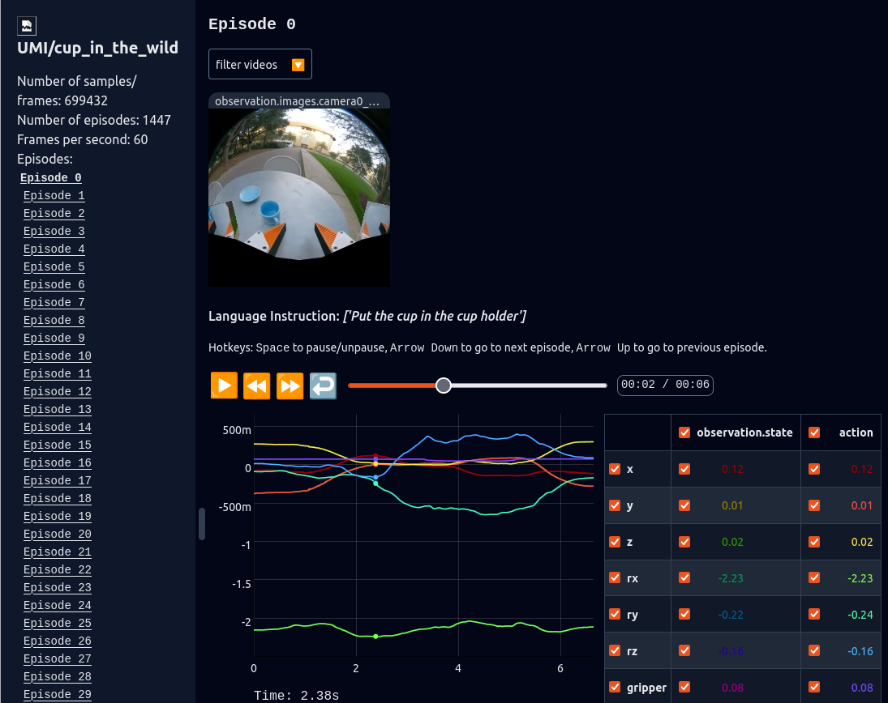

# umi2lerobot
将 https://umi-data.github.io/ 中的 UMI 数据转换成 lerobot 格式

## 安装

```bash
# 创建环境 
conda create -n umi2lerobot python=3.10 
conda activate umi2lerobot
conda install ffmpeg -c conda-forge
# 安装依赖
cd lerobot
pip install -e .
pip install zarr==2.18.3 numcodecs==0.13.1 imagecodecs==2025.3.30

## 运行  手动指定入参
python src/convert_umi_to_lerobot.py 
```

> **⚠️ 重要提示**
> 数据默认保存路径：
> ```bash
> \home\user\.cache\huggingface\lerobot\{project_name}|{subtask_name}
> ```


## 可视化

检查转化后的lerobot数据 是否正常且准确
```bash
python src/visualize_lerobot.py --root /path/to/lerobot/data
```



## 数据集
这里面有一些是不能用，没有提供直接使用的源数据，作者上传损坏等，具体错误多种多样，有些还是假开源的，还有里面的触觉数据是不准确的。。。。

转换后的数据集大致如下
### 1. MV-UMI: A Scalable Multi-View Interface for Cross-Embodiment Learning
UMI zarr格式：
```bash
/
 ├── data
 │   ├── camera0_rgb (164614, 224, 224, 3) uint8
 │   ├── camera1_rgb (164614, 224, 224, 3) uint8
 │   ├── robot0_demo_end_pose (164614, 6) float64
 │   ├── robot0_demo_start_pose (164614, 6) float64
 │   ├── robot0_eef_pos (164614, 3) float32
 │   ├── robot0_eef_rot_axis_angle (164614, 3) float32
 │   └── robot0_gripper_width (164614, 1) float32
 └── meta
     └── episode_ends (199,) int64
```
这里有三个子任务（用 HTML 表格演示合并单元格的效果）

<table style="border-collapse: collapse; width: 100%; text-align: center;">
	<thead>
		<tr>
			<th style="border: 1px solid #ccc; padding: 6px; text-align: center;">Task</th>
			<th style="border: 1px solid #ccc; padding: 6px; text-align: center;">文本描述</th>
			<th style="border: 1px solid #ccc; padding: 6px; text-align: center;">episode 个数</th>
			<th style="border: 1px solid #ccc; padding: 6px; text-align: center;">fps</th>
			<th style="border: 1px solid #ccc; padding: 6px; text-align: center;">Camera</th>
			<th style="border: 1px solid #ccc; padding: 6px; text-align: center;">单/双arm</th>
			<th style="border: 1px solid #ccc; padding: 6px; text-align: center;">夹爪/灵巧手</th>
			<th style="border: 1px solid #ccc; padding: 6px; text-align: center;">是否包含触觉</th>
		</tr>
	</thead>
	<tbody>
		<tr>
			<td style="border: 1px solid #ccc; padding: 6px;"><strong>Bottles Rack</strong></td>
			<td style="border: 1px solid #ccc; padding: 6px;">Pick the glass bottle from the table and places it on the shelf</td>
			<td style="border: 1px solid #ccc; padding: 6px;" align="center">199</td>
			<td style="border: 1px solid #ccc; padding: 6px;" align="center" rowspan="3">60</td>
			<td style="border: 1px solid #ccc; padding: 6px;" align="center" rowspan="3"><code>camera0_rgb</code> <br><code>camera1_rgb</code><br> 手腕+第三视角</td>
			<td style="border: 1px solid #ccc; padding: 6px;" align="center" rowspan="3">单</td>
			<td style="border: 1px solid #ccc; padding: 6px;" align="center" rowspan="3">夹爪</td>
			<td style="border: 1px solid #ccc; padding: 6px;" align="center" rowspan="3">否</td>
		</tr>
		<tr>
			<td style="border: 1px solid #ccc; padding: 6px;"><strong>Markers Placement</strong></td>
			<td style="border: 1px solid #ccc; padding: 6px;">Grab the marker pen on the desktop and place it in the pen holder</td>
			<td style="border: 1px solid #ccc; padding: 6px;" align="center">454</td>
		</tr>
		<tr>
			<td style="border: 1px solid #ccc; padding: 6px;"><strong>Markers Placement_raw</strong></td>
			<td style="border: 1px solid #ccc; padding: 6px;">Grab the marker pen on the desktop and place it in the pen holder</td>
			<td style="border: 1px solid #ccc; padding: 6px;" align="center">453</td>
		</tr>
		<tr>
			<td style="border: 1px solid #ccc; padding: 6px;"><strong>Cans Shelf Placement</strong></td>
			<td style="border: 1px solid #ccc; padding: 6px;">-</td>
			<td style="border: 1px solid #ccc; padding: 6px;" align="center">-</td>
			<td style="border: 1px solid #ccc; padding: 6px;" align="center">-</td>
			<td style="border: 1px solid #ccc; padding: 6px;" align="center">-</td>
			<td style="border: 1px solid #ccc; padding: 6px;" align="center">-</td>
			<td style="border: 1px solid #ccc; padding: 6px;" align="center">-</td>
			<td style="border: 1px solid #ccc; padding: 6px;" align="center">-</td>
		</tr>
	</tbody>
</table>

- Cans Shelf Placement 任务load后只有一堆MP4视频文件，跳过；
- Markers Placement_raw 和Markers Placement 数据一致，raw的视频没有把第三视角人的背景扣掉。


### 2. Touch in the Wild
UMI zarr格式：
```bash
/
 ├── data
 │   ├── camera0_rgb (232399, 224, 224, 3) uint8
 │   ├── camera0_tactile (232399, 12, 64) float32
 │   ├── robot0_demo_end_pose (232399, 6) float64
 │   ├── robot0_demo_start_pose (232399, 6) float64
 │   ├── robot0_eef_pos (232399, 3) float32
 │   ├── robot0_eef_rot_axis_angle (232399, 3) float32
 │   └── robot0_gripper_width (232399, 1) float32
 └── meta
     └── episode_ends (167,) int64
```


网站上用的是 **In-the-Wild Data** 和 **Indoor Tasks** 两部分，但是前者没有提供 .zarr.zip 文件，无法直接转化。后者共有 7个子任务：


<table style="border-collapse: collapse; width: 100%; text-align: center;">
	<thead>
		<tr>
			<th style="border: 1px solid #ccc; padding: 6px; text-align: center;">Task</th>
			<th style="border: 1px solid #ccc; padding: 6px; text-align: center;">文本描述</th>
			<th style="border: 1px solid #ccc; padding: 6px; text-align: center;">episode 个数</th>
			<th style="border: 1px solid #ccc; padding: 6px; text-align: center;">fps</th>
			<th style="border: 1px solid #ccc; padding: 6px; text-align: center;">Camera</th>
			<th style="border: 1px solid #ccc; padding: 6px; text-align: center;">单/双arm</th>
			<th style="border: 1px solid #ccc; padding: 6px; text-align: center;">夹爪/灵巧手</th>
			<th style="border: 1px solid #ccc; padding: 6px; text-align: center;">是否包含触觉</th>
		</tr>
	</thead>
	<tbody>
		<tr>
			<td style="border: 1px solid #ccc; padding: 6px;"><strong>Hex Key Insertion</strong></td>
			<td style="border: 1px solid #ccc; padding: 6px;">Grasp the hex key, align it with the screw hole on the table, and insert it.</td>
			<td style="border: 1px solid #ccc; padding: 6px;" align="center">167</td>
			<td style="border: 1px solid #ccc; padding: 6px;" align="center" rowspan="6">60</td>
			<td style="border: 1px solid #ccc; padding: 6px;" align="center" rowspan="6"><code>camera0_rgb</code><br>手腕</td>
			<td style="border: 1px solid #ccc; padding: 6px;" align="center" rowspan="6">单</td>
			<td style="border: 1px solid #ccc; padding: 6px;" align="center" rowspan="6">夹爪</td>
			<td style="border: 1px solid #ccc; padding: 6px;" align="center" rowspan="6">是</td>
		</tr>
		<tr>
			<td style="border: 1px solid #ccc; padding: 6px;"><strong>Move Cup</strong></td>
			<td style="border: 1px solid #ccc; padding: 6px;">Move the cup to the right</td>
			<td style="border: 1px solid #ccc; padding: 6px;" align="center">101</td>
		</tr>
		<tr>
			<td style="border: 1px solid #ccc; padding: 6px;"><strong>Move Tape</strong></td>
			<td style="border: 1px solid #ccc; padding: 6px;">Move the tape to the right</td>
			<td style="border: 1px solid #ccc; padding: 6px;" align="center">177</td>
		</tr>
        <tr>
			<td style="border: 1px solid #ccc; padding: 6px;"><strong>Peg Insertion</strong></td>
			<td style="border: 1px solid #ccc; padding: 6px;">Grasp the peg, align it with the hole on the board, and insert it fully.</td>
			<td style="border: 1px solid #ccc; padding: 6px;" align="center">177</td>
		</tr>
        <tr>
			<td style="border: 1px solid #ccc; padding: 6px;"><strong>Tossing</strong></td>
			<td style="border: 1px solid #ccc; padding: 6px;">Dynamic Tossing.</td>
			<td style="border: 1px solid #ccc; padding: 6px;" align="center">75</td>
		</tr>
        <tr>
			<td style="border: 1px solid #ccc; padding: 6px;"><strong>Whiteboard Erasing</strong></td>
			<td style="border: 1px solid #ccc; padding: 6px;">Erase all the words on the whiteboard</td>
			<td style="border: 1px solid #ccc; padding: 6px;" align="center"> 137</td>
		</tr>
        <tr>
			<td style="border: 1px solid #ccc; padding: 6px;"><strong>Writing</strong></td>
			<td style="border: 1px solid #ccc; padding: 6px;">-</td>
			<td style="border: 1px solid #ccc; padding: 6px;" align="center">-</td>
            <td style="border: 1px solid #ccc; padding: 6px;" align="center">-</td>
            <td style="border: 1px solid #ccc; padding: 6px;" align="center">-</td>
            <td style="border: 1px solid #ccc; padding: 6px;" align="center">-</td>
            <td style="border: 1px solid #ccc; padding: 6px;" align="center">-</td>
            <td style="border: 1px solid #ccc; padding: 6px;" align="center">-</td>
    	</tr>
	</tbody>
</table>


### 3. UMI on Legs

UMI zarr格式：
```bash
/
 ├── data
 │   ├── camera0_rgb (10004, 224, 224, 3) uint8
 │   ├── robot0_demo_end_pose (10004, 6) float64
 │   ├── robot0_demo_start_pose (10004, 6) float64
 │   ├── robot0_eef_pos (10004, 3) float32
 │   ├── robot0_eef_rot_axis_angle (10004, 3) float32
 │   └── robot0_gripper_width (10004, 1) float32
 └── meta
     └── episode_ends (14,) int64
```


<table style="border-collapse: collapse; width: 100%; text-align: center;">
	<thead>
		<tr>
			<th style="border: 1px solid #ccc; padding: 6px; text-align: center;">Task</th>
			<th style="border: 1px solid #ccc; padding: 6px; text-align: center;">文本描述</th>
			<th style="border: 1px solid #ccc; padding: 6px; text-align: center;">episode 个数</th>
			<th style="border: 1px solid #ccc; padding: 6px; text-align: center;">fps</th>
			<th style="border: 1px solid #ccc; padding: 6px; text-align: center;">Camera</th>
			<th style="border: 1px solid #ccc; padding: 6px; text-align: center;">单/双arm</th>
			<th style="border: 1px solid #ccc; padding: 6px; text-align: center;">夹爪/灵巧手</th>
			<th style="border: 1px solid #ccc; padding: 6px; text-align: center;">是否包含触觉</th>
		</tr>
	</thead>
	<tbody>
		<tr>
			<td style="border: 1px solid #ccc; padding: 6px;"><strong>Pushing</strong></td>
			<td style="border: 1px solid #ccc; padding: 6px;">Push the kettlebell forward</td>
			<td style="border: 1px solid #ccc; padding: 6px;" align="center">14</td>
			<td style="border: 1px solid #ccc; padding: 6px;" align="center" rowspan="3">60</td>
			<td style="border: 1px solid #ccc; padding: 6px;" align="center" rowspan="3"><code>camera0_rgb</code> <br> 手腕</td>
			<td style="border: 1px solid #ccc; padding: 6px;" align="center" rowspan="3">单</td>
			<td style="border: 1px solid #ccc; padding: 6px;" align="center" rowspan="3">夹爪</td>
			<td style="border: 1px solid #ccc; padding: 6px;" align="center" rowspan="3">否</td>
		</tr>
	</tbody>
</table>


## 4. UMI

UMI zarr格式：
```bash
/
 ├── data
 │   ├── camera0_rgb (309476, 224, 224, 3) uint8
 │   ├── camera1_rgb (309476, 224, 224, 3) uint8
 │   ├── robot0_eef_pos (309476, 3) float32
 │   ├── robot0_eef_rot_axis_angle (309476, 3) float32
 │   ├── robot0_gripper_width (309476, 1) float32
 │   ├── robot1_eef_pos (309476, 3) float32
 │   ├── robot1_eef_rot_axis_angle (309476, 3) float32
 │   └── robot1_gripper_width (309476, 1) float32
 └── meta
     └── episode_ends (249,) int64
```


<table style="border-collapse: collapse; width: 100%; text-align: center;">
	<thead>
		<tr>
			<th style="border: 1px solid #ccc; padding: 6px; text-align: center;">Task</th>
			<th style="border: 1px solid #ccc; padding: 6px; text-align: center;">文本描述</th>
			<th style="border: 1px solid #ccc; padding: 6px; text-align: center;">episode 个数</th>
			<th style="border: 1px solid #ccc; padding: 6px; text-align: center;">fps</th>
			<th style="border: 1px solid #ccc; padding: 6px; text-align: center;">Camera</th>
			<th style="border: 1px solid #ccc; padding: 6px; text-align: center;">单/双arm</th>
			<th style="border: 1px solid #ccc; padding: 6px; text-align: center;">夹爪/灵巧手</th>
			<th style="border: 1px solid #ccc; padding: 6px; text-align: center;">是否包含触觉</th>
		</tr>
	</thead>
	<tbody>
		<tr>
			<td style="border: 1px solid #ccc; padding: 6px;"><strong>bimanual_cloth_folding</strong></td>
			<td style="border: 1px solid #ccc; padding: 6px;">Fold cloth with two arms</td>
			<td style="border: 1px solid #ccc; padding: 6px;" align="center">249</td>
			<td style="border: 1px solid #ccc; padding: 6px;" align="center" rowspan="6">60</td>
			<td style="border: 1px solid #ccc; padding: 6px;" align="center" rowspan="2"><code>camera0_rgb</code><br><code>camera1_rgb</code><br>手腕 x2</td>
			<td style="border: 1px solid #ccc; padding: 6px;" align="center" rowspan="2">双</td>
			<td style="border: 1px solid #ccc; padding: 6px;" align="center" rowspan="6">夹爪</td>
			<td style="border: 1px solid #ccc; padding: 6px;" align="center" rowspan="6">否</td>
		</tr>
		<tr>
			<td style="border: 1px solid #ccc; padding: 6px;"><strong>bimanual_dish_washing</strong></td>
			<td style="border: 1px solid #ccc; padding: 6px;">Wash dishes with two arms</td>
			<td style="border: 1px solid #ccc; padding: 6px;" align="center">258</td>
		</tr>
		<tr>
			<td style="border: 1px solid #ccc; padding: 6px;"><strong>cup_in_the_table</strong></td>
			<td style="border: 1px solid #ccc; padding: 6px;">Put the cup in the cup holder</td>
			<td style="border: 1px solid #ccc; padding: 6px;" align="center">305</td>
			<td style="border: 1px solid #ccc; padding: 6px;" align="center" rowspan="3"><code>camera0_rgb</code><br>手腕</td>
			<td style="border: 1px solid #ccc; padding: 6px;" align="center"
			rowspan="3">单</td>
		</tr>
        <tr>
			<td style="border: 1px solid #ccc; padding: 6px;"><strong>cup_in_the_wild</strong></td>
			<td style="border: 1px solid #ccc; padding: 6px;">Put the cup in the cup holder</td>
			<td style="border: 1px solid #ccc; padding: 6px;" align="center">1447</td>
		</tr>
        <tr>
			<td style="border: 1px solid #ccc; padding: 6px;"><strong>dynamic_tossing</strong></td>
			<td style="border: 1px solid #ccc; padding: 6px;">Tossing smaller objects into a square basin and larger objects into a circular basin</td>
			<td style="border: 1px solid #ccc; padding: 6px;" align="center">284</td>
		</tr>
	</tbody>
</table>

左右手划分：
| 变量名 | 维度 | 对应状态 | 对应动作 |
|--------|------|----------|----------|
| robot0_eef_pos | (309476, 3) | observation.state[0:3] | action[0:3] |
| robot0_eef_rot_axis_angle | (3) | observation.state[3:6] | action[3:6] |
| robot0_gripper_width | (1) | observation.state[6] | action[6] |
| robot1_eef_pos | (3) | observation.state[7:10] | action[7:10] |
| robot1_eef_rot_axis_angle | (3) | observation.state[10:13] | action[10:13] |
| robot1_gripper_width | (1) | observation.state[13] | action[13] |


## 5. Data Scaling Laws
UMI zarr格式：
```bash
/
 ├── data
 │   ├── camera0_rgb (371534, 224, 224, 3) uint8
 │   ├── robot0_demo_end_pose (371534, 6) float64
 │   ├── robot0_demo_start_pose (371534, 6) float64
 │   ├── robot0_eef_pos (371534, 3) float32
 │   ├── robot0_eef_rot_axis_angle (371534, 3) float32
 │   └── robot0_gripper_width (371534, 1) float32
 └── meta
     └── episode_ends (1733,) int64
```

这里有四种子任务，分别是移动鼠标，叠毛巾，倒水和拔插头，其中移动鼠标和倒水扩充了多场景下，数据集相对较大。

<table style="border-collapse: collapse; width: 100%; text-align: center;">
	<thead>
		<tr>
			<th style="border: 1px solid #ccc; padding: 6px; text-align: center;">Task</th>
			<th style="border: 1px solid #ccc; padding: 6px; text-align: center;">文本描述</th>
			<th style="border: 1px solid #ccc; padding: 6px; text-align: center;">episode 个数</th>
			<th style="border: 1px solid #ccc; padding: 6px; text-align: center;">fps</th>
			<th style="border: 1px solid #ccc; padding: 6px; text-align: center;">Camera</th>
			<th style="border: 1px solid #ccc; padding: 6px; text-align: center;">单/双arm</th>
			<th style="border: 1px solid #ccc; padding: 6px; text-align: center;">夹爪/灵巧手</th>
			<th style="border: 1px solid #ccc; padding: 6px; text-align: center;">是否包含触觉</th>
		</tr>
	</thead>
	<tbody>
		<tr>
			<td style="border: 1px solid #ccc; padding: 6px;"><strong>arrange_mouse</strong></td>
			<td style="border: 1px solid #ccc; padding: 6px;">Move the mouse over the mouse pad</td>
			<td style="border: 1px solid #ccc; padding: 6px;" align="center">3564</td>
			<td style="border: 1px solid #ccc; padding: 6px;" align="center" rowspan="6">60</td>
			<td style="border: 1px solid #ccc; padding: 6px;" align="center" rowspan="6"><code>camera0_rgb</code> <br> 手腕</td>
			<td style="border: 1px solid #ccc; padding: 6px;" align="center" rowspan="6">单</td>
			<td style="border: 1px solid #ccc; padding: 6px;" align="center" rowspan="6">夹爪</td>
			<td style="border: 1px solid #ccc; padding: 6px;" align="center" rowspan="6">否</td>
		</tr>
		<tr>
			<td style="border: 1px solid #ccc; padding: 6px;"><strong>arrange_mouse_16_env_4_object</strong></td>
			<td style="border: 1px solid #ccc; padding: 6px;">Move the mouse over the mouse pad</td>
			<td style="border: 1px solid #ccc; padding: 6px;" align="center">6507</td>
		</tr>
		<tr>
			<td style="border: 1px solid #ccc; padding: 6px;"><strong>fold_towel</strong></td>
			<td style="border: 1px solid #ccc; padding: 6px;">fold the towel</td>
			<td style="border: 1px solid #ccc; padding: 6px;" align="center">1573</td>
		</tr>
		<tr>
			<td style="border: 1px solid #ccc; padding: 6px;"><strong>pour_water</strong></td>
			<td style="border: 1px solid #ccc; padding: 6px;">Pour the water from the bottle into the cup</td>
			<td style="border: 1px solid #ccc; padding: 6px;" align="center">3649</td>
		</tr>
				<tr>
			<td style="border: 1px solid #ccc; padding: 6px;"><strong>pour_water_16_env_4_object</strong></td>
			<td style="border: 1px solid #ccc; padding: 6px;">Grab the marker pen on the desktop and place it in the pen holder</td>
			<td style="border: 1px solid #ccc; padding: 6px;" align="center">6899</td>
		</tr>
		<tr>
			<td style="border: 1px solid #ccc; padding: 6px;"><strong>unplug_charger</strong></td>
			<td style="border: 1px solid #ccc; padding: 6px;">unplug the charger</td>
			<td style="border: 1px solid #ccc; padding: 6px;" align="center">1733</td>
		</tr>
	</tbody>
</table>


