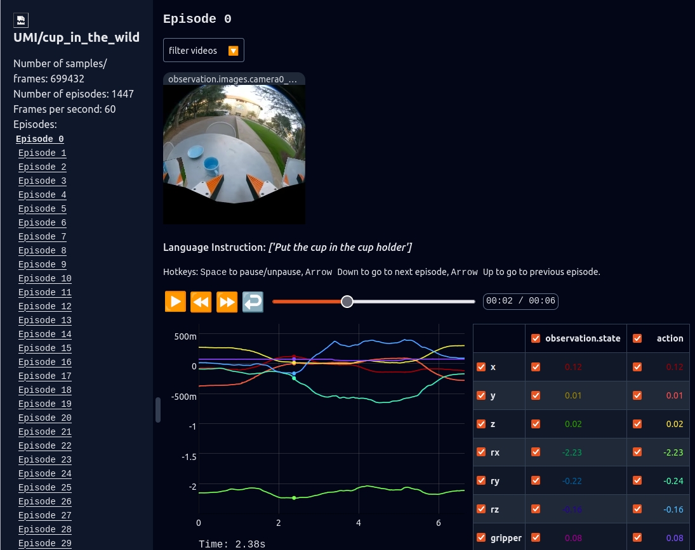

# umi2lerobot
将 https://umi-data.github.io/ 中的 UMI 数据转换成 lerobot 格式

## 安装

```bash
# 创建环境 
conda create -n umi2lerobot python=3.10 
conda activate umi2lerobot
conda install ffmpeg -c conda-forge
# 安装依赖
cd lerobot
pip install -e .
pip install zarr==2.18.3 numcodecs==0.13.1 imagecodecs==2025.3.30

## 运行  手动指定入参
python src/convert_umi_to_lerobot.py 
```

> **⚠️ 重要提示**
> 数据默认保存路径：
> ```bash
> \home\user\.cache\huggingface\lerobot\{project_name}|{subtask_name}
> ```


## 可视化

检查转化后的lerobot数据 是否正常且准确
```bash
python openx_lerobot_visualizer/visualize_dataset_html.py --root /path/to/lerobot/data
```



## 数据集
这里面有一些是不能用，没有提供直接使用的源数据，作者上传损坏等，具体错误多种多样，有些还是假开源的，还有里面的触觉数据是不准确的。。。。

转换后的数据集分字段名称如下：

```
{
  observation.images.camera0_rgb: Tensor with shape torch.Size([3, 224, 224])
  observation.state: Tensor with shape torch.Size([7])
  action: Tensor with shape torch.Size([7])
  observation.audio.mic_0: Tensor with shape torch.Size([800])
  observation.audio.mic_1: Tensor with shape torch.Size([800])
  timestamp: Tensor with shape torch.Size([])
  frame_index: Tensor with shape torch.Size([])
  episode_index: Tensor with shape torch.Size([])
  index: Tensor with shape torch.Size([])
  task_index: Tensor with shape torch.Size([])
  task: str
}
```
### 1. MV-UMI: A Scalable Multi-View Interface for Cross-Embodiment Learning
UMI zarr格式：
```bash
/
 ├── data
 │   ├── camera0_rgb (164614, 224, 224, 3) uint8
 │   ├── camera1_rgb (164614, 224, 224, 3) uint8
 │   ├── robot0_demo_end_pose (164614, 6) float64
 │   ├── robot0_demo_start_pose (164614, 6) float64
 │   ├── robot0_eef_pos (164614, 3) float32
 │   ├── robot0_eef_rot_axis_angle (164614, 3) float32
 │   └── robot0_gripper_width (164614, 1) float32
 └── meta
     └── episode_ends (199,) int64
```
这里有三个子任务（用 HTML 表格演示合并单元格的效果）

<table style="border-collapse: collapse; width: 100%; text-align: center;">
	<thead>
		<tr>
			<th style="border: 1px solid #ccc; padding: 6px; text-align: center;">Task</th>
			<th style="border: 1px solid #ccc; padding: 6px; text-align: center;">文本描述</th>
			<th style="border: 1px solid #ccc; padding: 6px; text-align: center;">episode 个数</th>
			<th style="border: 1px solid #ccc; padding: 6px; text-align: center;">fps</th>
			<th style="border: 1px solid #ccc; padding: 6px; text-align: center;">Camera</th>
			<th style="border: 1px solid #ccc; padding: 6px; text-align: center;">单/双arm</th>
			<th style="border: 1px solid #ccc; padding: 6px; text-align: center;">夹爪/灵巧手</th>
			<th style="border: 1px solid #ccc; padding: 6px; text-align: center;">是否包含触觉</th>
		</tr>
	</thead>
	<tbody>
		<tr>
			<td style="border: 1px solid #ccc; padding: 6px;"><strong>Bottles Rack</strong></td>
			<td style="border: 1px solid #ccc; padding: 6px;">Pick the glass bottle from the table and places it on the shelf</td>
			<td style="border: 1px solid #ccc; padding: 6px;" align="center">199</td>
			<td style="border: 1px solid #ccc; padding: 6px;" align="center" rowspan="3">60</td>
			<td style="border: 1px solid #ccc; padding: 6px;" align="center" rowspan="3"><code>camera0_rgb</code> <br><code>camera1_rgb</code><br> 手腕+第三视角</td>
			<td style="border: 1px solid #ccc; padding: 6px;" align="center" rowspan="3">单</td>
			<td style="border: 1px solid #ccc; padding: 6px;" align="center" rowspan="3">夹爪</td>
			<td style="border: 1px solid #ccc; padding: 6px;" align="center" rowspan="3">否</td>
		</tr>
		<tr>
			<td style="border: 1px solid #ccc; padding: 6px;"><strong>Markers Placement</strong></td>
			<td style="border: 1px solid #ccc; padding: 6px;">Grab the marker pen on the desktop and place it in the pen holder</td>
			<td style="border: 1px solid #ccc; padding: 6px;" align="center">454</td>
		</tr>
		<tr>
			<td style="border: 1px solid #ccc; padding: 6px;"><strong>Markers Placement_raw</strong></td>
			<td style="border: 1px solid #ccc; padding: 6px;">Grab the marker pen on the desktop and place it in the pen holder</td>
			<td style="border: 1px solid #ccc; padding: 6px;" align="center">453</td>
		</tr>
		<tr>
			<td style="border: 1px solid #ccc; padding: 6px;"><strong>Cans Shelf Placement</strong></td>
			<td style="border: 1px solid #ccc; padding: 6px;">-</td>
			<td style="border: 1px solid #ccc; padding: 6px;" align="center">-</td>
			<td style="border: 1px solid #ccc; padding: 6px;" align="center">-</td>
			<td style="border: 1px solid #ccc; padding: 6px;" align="center">-</td>
			<td style="border: 1px solid #ccc; padding: 6px;" align="center">-</td>
			<td style="border: 1px solid #ccc; padding: 6px;" align="center">-</td>
			<td style="border: 1px solid #ccc; padding: 6px;" align="center">-</td>
		</tr>
	</tbody>
</table>

- Cans Shelf Placement 任务load后只有一堆MP4视频文件，跳过；
- Markers Placement_raw 和Markers Placement 数据一致，raw的视频没有把第三视角人的背景扣掉。


### 2. Touch in the Wild
UMI zarr格式：
```bash
/
 ├── data
 │   ├── camera0_rgb (232399, 224, 224, 3) uint8
 │   ├── camera0_tactile (232399, 12, 64) float32
 │   ├── robot0_demo_end_pose (232399, 6) float64
 │   ├── robot0_demo_start_pose (232399, 6) float64
 │   ├── robot0_eef_pos (232399, 3) float32
 │   ├── robot0_eef_rot_axis_angle (232399, 3) float32
 │   └── robot0_gripper_width (232399, 1) float32
 └── meta
     └── episode_ends (167,) int64
```


网站上用的是 **In-the-Wild Data** 和 **Indoor Tasks** 两部分，但是前者没有提供 .zarr.zip 文件，无法直接转化。后者共有 7个子任务：


<table style="border-collapse: collapse; width: 100%; text-align: center;">
	<thead>
		<tr>
			<th style="border: 1px solid #ccc; padding: 6px; text-align: center;">Task</th>
			<th style="border: 1px solid #ccc; padding: 6px; text-align: center;">文本描述</th>
			<th style="border: 1px solid #ccc; padding: 6px; text-align: center;">episode 个数</th>
			<th style="border: 1px solid #ccc; padding: 6px; text-align: center;">fps</th>
			<th style="border: 1px solid #ccc; padding: 6px; text-align: center;">Camera</th>
			<th style="border: 1px solid #ccc; padding: 6px; text-align: center;">单/双arm</th>
			<th style="border: 1px solid #ccc; padding: 6px; text-align: center;">夹爪/灵巧手</th>
			<th style="border: 1px solid #ccc; padding: 6px; text-align: center;">是否包含触觉</th>
		</tr>
	</thead>
	<tbody>
		<tr>
			<td style="border: 1px solid #ccc; padding: 6px;"><strong>Hex Key Insertion</strong></td>
			<td style="border: 1px solid #ccc; padding: 6px;">Grasp the hex key, align it with the screw hole on the table, and insert it.</td>
			<td style="border: 1px solid #ccc; padding: 6px;" align="center">167</td>
			<td style="border: 1px solid #ccc; padding: 6px;" align="center" rowspan="6">60</td>
			<td style="border: 1px solid #ccc; padding: 6px;" align="center" rowspan="6"><code>camera0_rgb</code><br>手腕</td>
			<td style="border: 1px solid #ccc; padding: 6px;" align="center" rowspan="6">单</td>
			<td style="border: 1px solid #ccc; padding: 6px;" align="center" rowspan="6">夹爪</td>
			<td style="border: 1px solid #ccc; padding: 6px;" align="center" rowspan="6">是</td>
		</tr>
		<tr>
			<td style="border: 1px solid #ccc; padding: 6px;"><strong>Move Cup</strong></td>
			<td style="border: 1px solid #ccc; padding: 6px;">Move the cup to the right</td>
			<td style="border: 1px solid #ccc; padding: 6px;" align="center">101</td>
		</tr>
		<tr>
			<td style="border: 1px solid #ccc; padding: 6px;"><strong>Move Tape</strong></td>
			<td style="border: 1px solid #ccc; padding: 6px;">Move the tape to the right</td>
			<td style="border: 1px solid #ccc; padding: 6px;" align="center">177</td>
		</tr>
        <tr>
			<td style="border: 1px solid #ccc; padding: 6px;"><strong>Peg Insertion</strong></td>
			<td style="border: 1px solid #ccc; padding: 6px;">Grasp the peg, align it with the hole on the board, and insert it fully.</td>
			<td style="border: 1px solid #ccc; padding: 6px;" align="center">177</td>
		</tr>
        <tr>
			<td style="border: 1px solid #ccc; padding: 6px;"><strong>Tossing</strong></td>
			<td style="border: 1px solid #ccc; padding: 6px;">Dynamic Tossing.</td>
			<td style="border: 1px solid #ccc; padding: 6px;" align="center">75</td>
		</tr>
        <tr>
			<td style="border: 1px solid #ccc; padding: 6px;"><strong>Whiteboard Erasing</strong></td>
			<td style="border: 1px solid #ccc; padding: 6px;">Erase all the words on the whiteboard</td>
			<td style="border: 1px solid #ccc; padding: 6px;" align="center"> 137</td>
		</tr>
        <tr>
			<td style="border: 1px solid #ccc; padding: 6px;"><strong>Writing</strong></td>
			<td style="border: 1px solid #ccc; padding: 6px;">-</td>
			<td style="border: 1px solid #ccc; padding: 6px;" align="center">-</td>
            <td style="border: 1px solid #ccc; padding: 6px;" align="center">-</td>
            <td style="border: 1px solid #ccc; padding: 6px;" align="center">-</td>
            <td style="border: 1px solid #ccc; padding: 6px;" align="center">-</td>
            <td style="border: 1px solid #ccc; padding: 6px;" align="center">-</td>
            <td style="border: 1px solid #ccc; padding: 6px;" align="center">-</td>
    	</tr>
	</tbody>
</table>


### 3. UMI on Legs

UMI zarr格式：
```bash
/
 ├── data
 │   ├── camera0_rgb (10004, 224, 224, 3) uint8
 │   ├── robot0_demo_end_pose (10004, 6) float64
 │   ├── robot0_demo_start_pose (10004, 6) float64
 │   ├── robot0_eef_pos (10004, 3) float32
 │   ├── robot0_eef_rot_axis_angle (10004, 3) float32
 │   └── robot0_gripper_width (10004, 1) float32
 └── meta
     └── episode_ends (14,) int64
```


<table style="border-collapse: collapse; width: 100%; text-align: center;">
	<thead>
		<tr>
			<th style="border: 1px solid #ccc; padding: 6px; text-align: center;">Task</th>
			<th style="border: 1px solid #ccc; padding: 6px; text-align: center;">文本描述</th>
			<th style="border: 1px solid #ccc; padding: 6px; text-align: center;">episode 个数</th>
			<th style="border: 1px solid #ccc; padding: 6px; text-align: center;">fps</th>
			<th style="border: 1px solid #ccc; padding: 6px; text-align: center;">Camera</th>
			<th style="border: 1px solid #ccc; padding: 6px; text-align: center;">单/双arm</th>
			<th style="border: 1px solid #ccc; padding: 6px; text-align: center;">夹爪/灵巧手</th>
			<th style="border: 1px solid #ccc; padding: 6px; text-align: center;">是否包含触觉</th>
		</tr>
	</thead>
	<tbody>
		<tr>
			<td style="border: 1px solid #ccc; padding: 6px;"><strong>Pushing</strong></td>
			<td style="border: 1px solid #ccc; padding: 6px;">Push the kettlebell forward</td>
			<td style="border: 1px solid #ccc; padding: 6px;" align="center">14</td>
			<td style="border: 1px solid #ccc; padding: 6px;" align="center" rowspan="3">60</td>
			<td style="border: 1px solid #ccc; padding: 6px;" align="center" rowspan="3"><code>camera0_rgb</code> <br> 手腕</td>
			<td style="border: 1px solid #ccc; padding: 6px;" align="center" rowspan="3">单</td>
			<td style="border: 1px solid #ccc; padding: 6px;" align="center" rowspan="3">夹爪</td>
			<td style="border: 1px solid #ccc; padding: 6px;" align="center" rowspan="3">否</td>
		</tr>
	</tbody>
</table>


## 4. UMI

UMI zarr格式：
```bash
/
 ├── data
 │   ├── camera0_rgb (309476, 224, 224, 3) uint8
 │   ├── camera1_rgb (309476, 224, 224, 3) uint8
 │   ├── robot0_eef_pos (309476, 3) float32
 │   ├── robot0_eef_rot_axis_angle (309476, 3) float32
 │   ├── robot0_gripper_width (309476, 1) float32
 │   ├── robot1_eef_pos (309476, 3) float32
 │   ├── robot1_eef_rot_axis_angle (309476, 3) float32
 │   └── robot1_gripper_width (309476, 1) float32
 └── meta
     └── episode_ends (249,) int64
```


<table style="border-collapse: collapse; width: 100%; text-align: center;">
	<thead>
		<tr>
			<th style="border: 1px solid #ccc; padding: 6px; text-align: center;">Task</th>
			<th style="border: 1px solid #ccc; padding: 6px; text-align: center;">文本描述</th>
			<th style="border: 1px solid #ccc; padding: 6px; text-align: center;">episode 个数</th>
			<th style="border: 1px solid #ccc; padding: 6px; text-align: center;">fps</th>
			<th style="border: 1px solid #ccc; padding: 6px; text-align: center;">Camera</th>
			<th style="border: 1px solid #ccc; padding: 6px; text-align: center;">单/双arm</th>
			<th style="border: 1px solid #ccc; padding: 6px; text-align: center;">夹爪/灵巧手</th>
			<th style="border: 1px solid #ccc; padding: 6px; text-align: center;">是否包含触觉</th>
		</tr>
	</thead>
	<tbody>
		<tr>
			<td style="border: 1px solid #ccc; padding: 6px;"><strong>bimanual_cloth_folding</strong></td>
			<td style="border: 1px solid #ccc; padding: 6px;">Fold cloth with two arms</td>
			<td style="border: 1px solid #ccc; padding: 6px;" align="center">249</td>
			<td style="border: 1px solid #ccc; padding: 6px;" align="center" rowspan="6">60</td>
			<td style="border: 1px solid #ccc; padding: 6px;" align="center" rowspan="2"><code>camera0_rgb</code><br><code>camera1_rgb</code><br>手腕 x2</td>
			<td style="border: 1px solid #ccc; padding: 6px;" align="center" rowspan="2">双</td>
			<td style="border: 1px solid #ccc; padding: 6px;" align="center" rowspan="6">夹爪</td>
			<td style="border: 1px solid #ccc; padding: 6px;" align="center" rowspan="6">否</td>
		</tr>
		<tr>
			<td style="border: 1px solid #ccc; padding: 6px;"><strong>bimanual_dish_washing</strong></td>
			<td style="border: 1px solid #ccc; padding: 6px;">Wash dishes with two arms</td>
			<td style="border: 1px solid #ccc; padding: 6px;" align="center">258</td>
		</tr>
		<tr>
			<td style="border: 1px solid #ccc; padding: 6px;"><strong>cup_in_the_table</strong></td>
			<td style="border: 1px solid #ccc; padding: 6px;">Put the cup in the cup holder</td>
			<td style="border: 1px solid #ccc; padding: 6px;" align="center">305</td>
			<td style="border: 1px solid #ccc; padding: 6px;" align="center" rowspan="3"><code>camera0_rgb</code><br>手腕</td>
			<td style="border: 1px solid #ccc; padding: 6px;" align="center"
			rowspan="3">单</td>
		</tr>
        <tr>
			<td style="border: 1px solid #ccc; padding: 6px;"><strong>cup_in_the_wild</strong></td>
			<td style="border: 1px solid #ccc; padding: 6px;">Put the cup in the cup holder</td>
			<td style="border: 1px solid #ccc; padding: 6px;" align="center">1447</td>
		</tr>
        <tr>
			<td style="border: 1px solid #ccc; padding: 6px;"><strong>dynamic_tossing</strong></td>
			<td style="border: 1px solid #ccc; padding: 6px;">Tossing smaller objects into a square basin and larger objects into a circular basin</td>
			<td style="border: 1px solid #ccc; padding: 6px;" align="center">284</td>
		</tr>
	</tbody>
</table>

左右手划分：
| 变量名 | 维度 | 对应状态 | 对应动作 |
|--------|------|----------|----------|
| robot0_eef_pos | (309476, 3) | observation.state[0:3] | action[0:3] |
| robot0_eef_rot_axis_angle | (3) | observation.state[3:6] | action[3:6] |
| robot0_gripper_width | (1) | observation.state[6] | action[6] |
| robot1_eef_pos | (3) | observation.state[7:10] | action[7:10] |
| robot1_eef_rot_axis_angle | (3) | observation.state[10:13] | action[10:13] |
| robot1_gripper_width | (1) | observation.state[13] | action[13] |


## 5. Data Scaling Laws
UMI zarr格式：
```bash
/
 ├── data
 │   ├── camera0_rgb (371534, 224, 224, 3) uint8
 │   ├── robot0_demo_end_pose (371534, 6) float64
 │   ├── robot0_demo_start_pose (371534, 6) float64
 │   ├── robot0_eef_pos (371534, 3) float32
 │   ├── robot0_eef_rot_axis_angle (371534, 3) float32
 │   └── robot0_gripper_width (371534, 1) float32
 └── meta
     └── episode_ends (1733,) int64
```

这里有四种子任务，分别是移动鼠标，叠毛巾，倒水和拔插头，其中移动鼠标和倒水扩充了多场景下，数据集相对较大。

<table style="border-collapse: collapse; width: 100%; text-align: center;">
	<thead>
		<tr>
			<th style="border: 1px solid #ccc; padding: 6px; text-align: center;">Task</th>
			<th style="border: 1px solid #ccc; padding: 6px; text-align: center;">文本描述</th>
			<th style="border: 1px solid #ccc; padding: 6px; text-align: center;">episode 个数</th>
			<th style="border: 1px solid #ccc; padding: 6px; text-align: center;">fps</th>
			<th style="border: 1px solid #ccc; padding: 6px; text-align: center;">Camera</th>
			<th style="border: 1px solid #ccc; padding: 6px; text-align: center;">单/双arm</th>
			<th style="border: 1px solid #ccc; padding: 6px; text-align: center;">夹爪/灵巧手</th>
			<th style="border: 1px solid #ccc; padding: 6px; text-align: center;">是否包含触觉</th>
		</tr>
	</thead>
	<tbody>
		<tr>
			<td style="border: 1px solid #ccc; padding: 6px;"><strong>arrange_mouse</strong></td>
			<td style="border: 1px solid #ccc; padding: 6px;">Move the mouse over the mouse pad</td>
			<td style="border: 1px solid #ccc; padding: 6px;" align="center">3564</td>
			<td style="border: 1px solid #ccc; padding: 6px;" align="center" rowspan="6">60</td>
			<td style="border: 1px solid #ccc; padding: 6px;" align="center" rowspan="6"><code>camera0_rgb</code> <br> 手腕</td>
			<td style="border: 1px solid #ccc; padding: 6px;" align="center" rowspan="6">单</td>
			<td style="border: 1px solid #ccc; padding: 6px;" align="center" rowspan="6">夹爪</td>
			<td style="border: 1px solid #ccc; padding: 6px;" align="center" rowspan="6">否</td>
		</tr>
		<tr>
			<td style="border: 1px solid #ccc; padding: 6px;"><strong>arrange_mouse_16_env_4_object</strong></td>
			<td style="border: 1px solid #ccc; padding: 6px;">Move the mouse over the mouse pad</td>
			<td style="border: 1px solid #ccc; padding: 6px;" align="center">6507</td>
		</tr>
		<tr>
			<td style="border: 1px solid #ccc; padding: 6px;"><strong>fold_towel</strong></td>
			<td style="border: 1px solid #ccc; padding: 6px;">fold the towel</td>
			<td style="border: 1px solid #ccc; padding: 6px;" align="center">1573</td>
		</tr>
		<tr>
			<td style="border: 1px solid #ccc; padding: 6px;"><strong>pour_water</strong></td>
			<td style="border: 1px solid #ccc; padding: 6px;">Pour the water from the bottle into the cup</td>
			<td style="border: 1px solid #ccc; padding: 6px;" align="center">3649</td>
		</tr>
				<tr>
			<td style="border: 1px solid #ccc; padding: 6px;"><strong>pour_water_16_env_4_object</strong></td>
			<td style="border: 1px solid #ccc; padding: 6px;">Grab the marker pen on the desktop and place it in the pen holder</td>
			<td style="border: 1px solid #ccc; padding: 6px;" align="center">6899</td>
		</tr>
		<tr>
			<td style="border: 1px solid #ccc; padding: 6px;"><strong>unplug_charger</strong></td>
			<td style="border: 1px solid #ccc; padding: 6px;">unplug the charger</td>
			<td style="border: 1px solid #ccc; padding: 6px;" align="center">1733</td>
		</tr>
	</tbody>
</table>

## 6. ManiWAV

1. 这个任务增加了语言字段，长度都是800，
2. **前面所有的任务 action 都是使用robot0_eef_pos + robot0_eef_rot_axis_angle + robot0_gripper_width 按顺序拼接的，state是使用上一个时间戳的action（0时刻的state就是当前action）。**

```bash
/
 ├── data
 │   ├── camera0_rgb (107187, 224, 224, 3) uint8
 │   ├── mic_0 (107187, 800) float64
 │   ├── mic_1 (107187, 800) float64
 │   ├── robot0_eef_pos (107187, 3) float32
 │   ├── robot0_eef_rot_axis_angle (107187, 3) float32
 │   └── robot0_gripper_width (107187, 1) float32
 └── meta
     └── episode_ends (119,) int64
```
<table style="border-collapse: collapse; width: 100%; text-align: center;">
	<thead>
		<tr>
			<th style="border: 1px solid #ccc; padding: 6px; text-align: center;">Task</th>
			<th style="border: 1px solid #ccc; padding: 6px; text-align: center;">文本描述</th>
			<th style="border: 1px solid #ccc; padding: 6px; text-align: center;">episode 个数</th>
			<th style="border: 1px solid #ccc; padding: 6px; text-align: center;">fps</th>
			<th style="border: 1px solid #ccc; padding: 6px; text-align: center;">Camera</th>
			<th style="border: 1px solid #ccc; padding: 6px; text-align: center;">单/双arm</th>
			<th style="border: 1px solid #ccc; padding: 6px; text-align: center;">夹爪/灵巧手</th>
			<th style="border: 1px solid #ccc; padding: 6px; text-align: center;">其余模态</th>
		</tr>
	</thead>
	<tbody>
		<tr>
			<td style="border: 1px solid #ccc; padding: 6px;"><strong>Flip bagel</strong></td>
			<td style="border: 1px solid #ccc; padding: 6px;">Move the mouse over the mouse pad</td>
			<td style="border: 1px solid #ccc; padding: 6px;" align="center">283</td>
			<td style="border: 1px solid #ccc; padding: 6px;" align="center" rowspan="6">60</td>
			<td style="border: 1px solid #ccc; padding: 6px;" align="center" rowspan="6"><code>camera0_rgb</code> <br> 手腕</td>
			<td style="border: 1px solid #ccc; padding: 6px;" align="center" rowspan="6">单</td>
			<td style="border: 1px solid #ccc; padding: 6px;" align="center" rowspan="6">夹爪</td>
			<td style="border: 1px solid #ccc; padding: 6px;" align="center" rowspan="6">音频</td>
		</tr>
		<tr>
			<td style="border: 1px solid #ccc; padding: 6px;">
			<strong>Flip bagel in the wild</strong></td>
			<td style="border: 1px solid #ccc; padding: 6px;">flip the bagel</td>
			<td style="border: 1px solid #ccc; padding: 6px;" align="center">557</td>
		</tr>
		<tr>
			<td style="border: 1px solid #ccc; padding: 6px;"><strong>Pour dice</strong></td>
			<td style="border: 1px solid #ccc; padding: 6px;">Pour the dice to the cup</td>
			<td style="border: 1px solid #ccc; padding: 6px;" align="center">145</td>
		</tr>
		<tr>
			<td style="border: 1px solid #ccc; padding: 6px;"><strong>Strap wires with velcro tape</strong></td>
			<td style="border: 1px solid #ccc; padding: 6px;">Strap wires with velcro tape</td>
			<td style="border: 1px solid #ccc; padding: 6px;" align="center">193</td>
		</tr>
				<tr>
			<td style="border: 1px solid #ccc; padding: 6px;"><strong>Whiteboard Shape Wipe</strong></td>
			<td style="border: 1px solid #ccc; padding: 6px;">Wipe the words on the whiteboard clean</td>
			<td style="border: 1px solid #ccc; padding: 6px;" align="center">119</td>
		</tr>
	</tbody>
</table>

## 7. ViTaMin
这个任务增加了tactile字段，类似于夹爪内部的图像，夹取时候图像有明显变化，同时这里开始记录robot0_demo_end_pose 和robot0_demo_start_pose 字段。
```python
/
 ├── data
 │   ├── camera0_left_tactile (33173, 224, 224, 3) uint8
 │   ├── camera0_rgb (33173, 224, 224, 3) uint8
 │   ├── camera0_right_tactile (33173, 224, 224, 3) uint8
 │   ├── robot0_demo_end_pose (33173, 6) float64
 │   ├── robot0_demo_start_pose (33173, 6) float64
 │   ├── robot0_eef_pos (33173, 3) float32
 │   ├── robot0_eef_rot_axis_angle (33173, 3) float32
 │   └── robot0_gripper_width (33173, 1) float32
 └── meta
     └── episode_ends (129,) int64
```

<table style="border-collapse: collapse; width: 100%; text-align: center;">
	<thead>
		<tr>
			<th style="border: 1px solid #ccc; padding: 6px; text-align: center;">Task</th>
			<th style="border: 1px solid #ccc; padding: 6px; text-align: center;">文本描述</th>
			<th style="border: 1px solid #ccc; padding: 6px; text-align: center;">episode 个数</th>
			<th style="border: 1px solid #ccc; padding: 6px; text-align: center;">fps</th>
			<th style="border: 1px solid #ccc; padding: 6px; text-align: center;">Camera</th>
			<th style="border: 1px solid #ccc; padding: 6px; text-align: center;">单/双arm</th>
			<th style="border: 1px solid #ccc; padding: 6px; text-align: center;">夹爪/灵巧手</th>
			<th style="border: 1px solid #ccc; padding: 6px; text-align: center;">其余模态</th>
		</tr>
	</thead>
	<tbody>
		<tr>
			<td style="border: 1px solid #ccc; padding: 6px;"><strong>Articulated_Object_Manipulation</strong></td>
			<td style="border: 1px solid #ccc; padding: 6px;">Rotate the Articulated Object</td>
			<td style="border: 1px solid #ccc; padding: 6px;" align="center">75</td>
			<td style="border: 1px solid #ccc; padding: 6px;" align="center" rowspan="6">60</td>
			<td style="border: 1px solid #ccc; padding: 6px;" align="center" rowspan="6"><code>camera0_rgb</code> <br> <code>left_tactile</code> <br><code>right_tactile</code> <br> 手腕+夹爪左右相机</td>
			<td style="border: 1px solid #ccc; padding: 6px;" align="center" rowspan="6">单</td>
			<td style="border: 1px solid #ccc; padding: 6px;" align="center" rowspan="6">夹爪</td>
			<td style="border: 1px solid #ccc; padding: 6px;" align="center" rowspan="6">-</td>
		</tr>
		<tr>
			<td style="border: 1px solid #ccc; padding: 6px;"><strong>Dynamic_Peg_Insertion</strong></td>
			<td style="border: 1px solid #ccc; padding: 6px;">Insert a peg into a moving pile </td>
			<td style="border: 1px solid #ccc; padding: 6px;" align="center">129</td>
		</tr>
		<tr>
			<td style="border: 1px solid #ccc; padding: 6px;"><strong>Orange_Placement</strong></td>
			<td style="border: 1px solid #ccc; padding: 6px;">Move the orange and place it on the plate</td>
			<td style="border: 1px solid #ccc; padding: 6px;" align="center">110</td>
		</tr>
		<tr>
			<td style="border: 1px solid #ccc; padding: 6px;"><strong>Scissor_Hanging</strong></td>
			<td style="border: 1px solid #ccc; padding: 6px;">Hang the scissors on the rack</td>
			<td style="border: 1px solid #ccc; padding: 6px;" align="center">134</td>
		</tr>
				<tr>
			<td style="border: 1px solid #ccc; padding: 6px;"><strong>Sponge_Insertion</strong></td>
			<td style="border: 1px solid #ccc; padding: 6px;">Insert the sponge into the cup</td>
			<td style="border: 1px solid #ccc; padding: 6px;" align="center">138</td>
		</tr>
		<tr>
			<td style="border: 1px solid #ccc; padding: 6px;"><strong>Test_Tube_Reorientation</strong></td>
			<td style="border: 1px solid #ccc; padding: 6px;">Test Tube Reorientation</td>
			<td style="border: 1px solid #ccc; padding: 6px;" align="center">161</td>
		</tr>
	</tbody>
</table>


## 8. ManiForce
```python
/
 ├── data
 │   ├── action (25288, 8) float32
 │   ├── ft_data (246357, 6) float32
 │   ├── ft_timestamps (246357,) float64
 │   ├── handeye_cam_1 (25288, 800, 1280, 3) uint8
 │   ├── handeye_cam_2 (25288, 480, 640, 3) uint8
 │   ├── img_timestamps (25288,) float64
 │   ├── pose_wrt_start (25288, 7) float32
 │   └── state (25288, 7) float32
 └── meta
     ├── episode_ends (107,) int64
     ├── episode_ft_ends (107,) int64
     └── episode_img_ends (107,) int64
```
1. 这里提供字段较多，没有将之前的eef_pos、eef_rot_axis_angle、gripper_width组合在一起，直接使用现成的action 和state，但是这个项目只有主页 代码和论文都没有，action 的8个数值可能是  `motors=["x","y","z","qx","qy","qz","qw","gripper"]` 不是之前的`rx,ry,rz`。
2. 根据之前UMI论文中 state字段由上一时刻的action代替。

<table style="border-collapse: collapse; width: 100%; text-align: center;">
	<thead>
		<tr>
			<th style="border: 1px solid #ccc; padding: 6px; text-align: center;">Task</th>
			<th style="border: 1px solid #ccc; padding: 6px; text-align: center;">文本描述</th>
			<th style="border: 1px solid #ccc; padding: 6px; text-align: center;">episode 个数</th>
			<th style="border: 1px solid #ccc; padding: 6px; text-align: center;">fps</th>
			<th style="border: 1px solid #ccc; padding: 6px; text-align: center;">Camera</th>
			<th style="border: 1px solid #ccc; padding: 6px; text-align: center;">单/双arm</th>
			<th style="border: 1px solid #ccc; padding: 6px; text-align: center;">夹爪/灵巧手</th>
			<th style="border: 1px solid #ccc; padding: 6px; text-align: center;">其余模态</th>
		</tr>
	</thead>
	<tbody>
		<tr>
			<td style="border: 1px solid #ccc; padding: 6px;"><strong>Battery_assembly</strong></td>
			<td style="border: 1px solid #ccc; padding: 6px;">Assemble the battery in the appropriate position</td>
			<td style="border: 1px solid #ccc; padding: 6px;" align="center">107</td>
			<td style="border: 1px solid #ccc; padding: 6px;" align="center" rowspan="6">30</td>
			<td style="border: 1px solid #ccc; padding: 6px;" align="center" rowspan="6"><code>handeye_cam_1</code> <br> <code>handeye_cam_2</code> <br> 手腕x2</td>
			<td style="border: 1px solid #ccc; padding: 6px;" align="center" rowspan="6">单</td>
			<td style="border: 1px solid #ccc; padding: 6px;" align="center" rowspan="6">夹爪</td>
			<td style="border: 1px solid #ccc; padding: 6px;" align="center" rowspan="6">-</td>
		</tr>
		<tr>
			<td style="border: 1px solid #ccc; padding: 6px;"><strong>Battery_disassembly</strong></td>
			<td style="border: 1px solid #ccc; padding: 6px;">Disassemble the battery from the appropriate position</td>
			<td style="border: 1px solid #ccc; padding: 6px;" align="center">108</td>
		</tr>
		<tr>
			<td style="border: 1px solid #ccc; padding: 6px;"><strong>Box_flipping</strong></td>
			<td style="border: 1px solid #ccc; padding: 6px;">Flip the box</td>
			<td style="border: 1px solid #ccc; padding: 6px;" align="center">69</td>
		</tr>
		<tr>
			<td style="border: 1px solid #ccc; padding: 6px;"><strong>Gear_assembly</strong></td>
			<td style="border: 1px solid #ccc; padding: 6px;">Assemble the gear</td>
			<td style="border: 1px solid #ccc; padding: 6px;" align="center">101</td>
		</tr>
				<tr>
			<td style="border: 1px solid #ccc; padding: 6px;"><strong>LAN_insertion</strong></td>
			<td style="border: 1px solid #ccc; padding: 6px;">Insert the LAN</td>
			<td style="border: 1px solid #ccc; padding: 6px;" align="center">110</td>
		</tr>
		<tr>
			<td style="border: 1px solid #ccc; padding: 6px;"><strong>Open_lid</strong></td>
			<td style="border: 1px solid #ccc; padding: 6px;">Open the lid</td>
			<td style="border: 1px solid #ccc; padding: 6px;" align="center">102</td>
		</tr>
	</tbody>
</table>

转为lerobot保存的字段如下：
```python
{
  observation.images.handeye_cam_1: Tensor with shape torch.Size([3, 800, 1280])
  observation.images.handeye_cam_2: Tensor with shape torch.Size([3, 480, 640])
  observation.state: Tensor with shape torch.Size([7])
  action: Tensor with shape torch.Size([8])
  observation.state.pose_wrt_start: Tensor with shape torch.Size([7])
  ...
  ...
}
```


## 9. LEGATO 

这是HDF5格式的数据，三个任务，但是分为仿真sim的和真实real的，个别几个字段不同，数据结构分别如下：

```python
# 仿真sim
📁 /
├── 📁 data/
│   ├── 📁 demo_1/ ... demo_99/    (共 99 个演示)
│   │   ├── 📄 actions         (N, 7) float32    # 机器人动作
│   │   ├── 📄 dones           (N,) uint8        # 是否结束
│   │   ├── 📄 rewards         (N,) float32      # 奖励值
│   │   └── 📁 obs/                              # 观测数据
│   │       ├── 📄 delta_eulers      (N, 6) float32   # 欧拉角增量
│   │       ├── 📄 delta_positions   (N, 6) float32   # 位置增量
│   │       ├── 📄 delta_quaternions (N, 8) float32   # 四元数增量
│   │       ├── 📄 left_gray         (N, 128, 128, 1) uint8  # 左相机灰度图
│   │       ├── 📄 position_diffs    (N, 6) float32   # 位置差
│   │       ├── 📄 quaternions       (N, 8) float32   # 四元数
│   │       └── 📄 right_gray        (N, 128, 128, 1) uint8  # 右相机灰度图
│   │
└── 📁 mask/
    ├── 📄 train    (135,) |S8    # 训练集 demo 名称列表
    └── 📄 valid    (15,) |S8     # 验证集 demo 名称列表

```

```python
# 真实real
📁 /
├── 📁 data/
│   ├── 📁 demo_1/ ... demo_150/    (共 150 个演示)
│   │   ├── 📄 actions         (N, 7) float32    # 机器人动作
│   │   ├── 📄 dones           (N,) uint8        # 是否结束
│   │   ├── 📄 rewards         (N,) float32      # 奖励值
│   │   └── 📁 obs/                              # 观测数据
│   │       ├── 📄 delta_eulers      (N, 6) float32   # 欧拉角增量
│   │       ├── 📄 delta_positions   (N, 6) float32   # 位置增量
│   │       ├── 📄 delta_quaternions (N, 8) float32   # 四元数增量
│   │       ├── 📄 graspings         (N, 2) float32   # 抓取状态
│   │       ├── 📄 left_gray         (N, 128, 128, 1) uint8  # 左相机灰度图
│   │       └── 📄 right_gray        (N, 128, 128, 1) uint8  # 右相机灰度图
│   │
└── 📁 mask/
    ├── 📄 train    (135,) |S8    # 训练集 demo 名称列表
    └── 📄 valid    (15,) |S8     # 验证集 demo 名称列表

```
> 注意:
1. 这个数据只提供单通道灰度图，但是lerobot 要求是三通道，所以这里将其广播复制到三通道.
2. 原始数据中的mask字段是 区分训练集和验证集的，这里写到 mask.json 中，和data/video 同级目录。

<table style="border-collapse: collapse; width: 100%; text-align: center;">
	<thead>
		<tr>
			<th style="border: 1px solid #ccc; padding: 6px; text-align: center;">Task</th>
			<th style="border: 1px solid #ccc; padding: 6px; text-align: center;">文本描述</th>
			<th style="border: 1px solid #ccc; padding: 6px; text-align: center;">episode 个数</th>
			<th style="border: 1px solid #ccc; padding: 6px; text-align: center;">fps</th>
			<th style="border: 1px solid #ccc; padding: 6px; text-align: center;">Camera</th>
			<th style="border: 1px solid #ccc; padding: 6px; text-align: center;">单/双arm</th>
			<th style="border: 1px solid #ccc; padding: 6px; text-align: center;">夹爪/灵巧手</th>
			<th style="border: 1px solid #ccc; padding: 6px; text-align: center;">其余模态</th>
		</tr>
	</thead>
	<tbody>
		<tr>
			<td style="border: 1px solid #ccc; padding: 6px;"><strong>closing the lid</strong></td>
			<td style="border: 1px solid #ccc; padding: 6px;">closing the lid</td>
			<td style="border: 1px solid #ccc; padding: 6px;" align="center">150+150 <br>(real+sim)</td>
			<td style="border: 1px solid #ccc; padding: 6px;" align="center" rowspan="6">30</td>
			<td style="border: 1px solid #ccc; padding: 6px;" align="center" rowspan="6"><code>left_gray</code> <br> <code>right_gray</code> <br> 手腕x2</td>
			<td style="border: 1px solid #ccc; padding: 6px;" align="center" rowspan="6">单</td>
			<td style="border: 1px solid #ccc; padding: 6px;" align="center" rowspan="6">夹爪</td>
			<td style="border: 1px solid #ccc; padding: 6px;" align="center" rowspan="6">-</td>
		</tr>
		<tr>
			<td style="border: 1px solid #ccc; padding: 6px;"><strong>cup_shelving</strong></td>
			<td style="border: 1px solid #ccc; padding: 6px;">Move the cup inside the cabinet</td>
			<td style="border: 1px solid #ccc; padding: 6px;" align="center">150+150 <br>(real+sim)</td>
		</tr>
		<tr>
			<td style="border: 1px solid #ccc; padding: 6px;"><strong>ladle_reorganization</strong></td>
			<td style="border: 1px solid #ccc; padding: 6px;">Put the ladle on the plate</td>
			<td style="border: 1px solid #ccc; padding: 6px;" align="center">150+150 <br>(real+sim)</td>
		</tr>
	</tbody>
</table>
转好的lerobot字段为

```python
{
  observation.images.left_gray: Tensor with shape torch.Size([3, 128, 128])
  observation.images.right_gray: Tensor with shape torch.Size([3, 128, 128])
  observation.state: Tensor with shape torch.Size([7])
  action: Tensor with shape torch.Size([7])
  observation.delta_eulers: Tensor with shape torch.Size([6])
  observation.delta_positions: Tensor with shape torch.Size([6])
  observation.delta_quaternions: Tensor with shape torch.Size([8])
  observation.dones: Tensor with shape torch.Size([])
  observation.rewards: Tensor with shape torch.Size([])
  ...
  ...
}
```
## 10.DexUMI
这个项目其实就三个子任务，但是作者根据采集的日期又在每个任务下分了几个子任务，内容一样。

```python
/
 ├── camera_0
 │   └── rgb (571, 400, 640, 3) uint8
 ├── fsr (571, 3) float64
 ├── hand_action (571, 12) float32
 ├── pose (571, 6) float64
 └── proprioception (571, 12) float32
 ```
> 注意:
 1. 有两种灵巧手，一种是Inspire 6Dof 一种是XHand 12Dof，具体区别可以在 `constant.py` 中查看
 2. hand_action 和 proprioception 是手的 action 和state。 dsr是Force Sensitive Resistor (力敏电阻) 它是触觉传感器 (Tactile Sensor) 的原始数据。

<table style="border-collapse: collapse; width: 100%; text-align: center;">
	<thead>
		<tr>
			<th style="border: 1px solid #ccc; padding: 6px; text-align: center;">Task</th>
			<th style="border: 1px solid #ccc; padding: 6px; text-align: center;">文本描述</th>
			<th style="border: 1px solid #ccc; padding: 6px; text-align: center;">episode 个数</th>
			<th style="border: 1px solid #ccc; padding: 6px; text-align: center;">fps</th>
			<th style="border: 1px solid #ccc; padding: 6px; text-align: center;">Camera</th>
			<th style="border: 1px solid #ccc; padding: 6px; text-align: center;">单/双arm</th>
			<th style="border: 1px solid #ccc; padding: 6px; text-align: center;">夹爪/灵巧手</th>
			<th style="border: 1px solid #ccc; padding: 6px; text-align: center;">其余模态</th>
		</tr>
	</thead>
	<tbody>
		<tr>
			<td style="border: 1px solid #ccc; padding: 6px;"><strong>inspire_cube_picking</strong></td>
			<td style="border: 1px solid #ccc; padding: 6px;">Pick up the cube and place in on the cup</td>
			<td style="border: 1px solid #ccc; padding: 6px;" align="center">160+149</td>
			<td style="border: 1px solid #ccc; padding: 6px;" align="center" rowspan="6">30</td>
			<td style="border: 1px solid #ccc; padding: 6px;" align="center" rowspan="6"><code>left_gray</code> <br> <code>right_gray</code> <br> 手腕x2</td>
			<td style="border: 1px solid #ccc; padding: 6px;" align="center" rowspan="6">单</td>
			<td style="border: 1px solid #ccc; padding: 6px;" align="center" rowspan="6">灵巧手<br><code>Inspire</code> <br> <code>XHand</code></td>
			<td style="border: 1px solid #ccc; padding: 6px;" align="center" rowspan="6">fsr</td>
		</tr>
		<tr>
			<td style="border: 1px solid #ccc; padding: 6px;"><strong>inspire_egg_carton</strong></td>
			<td style="border: 1px solid #ccc; padding: 6px;">Open the lid on the egg box</td>
			<td style="border: 1px solid #ccc; padding: 6px;" align="center">75+100</td>
		</tr>
		<tr>
			<td style="border: 1px solid #ccc; padding: 6px;"><strong>inspire_tool_use</strong></td>
			<td style="border: 1px solid #ccc; padding: 6px;">Use a clip to pick up the tea leaves and place them in a cup</td>
			<td style="border: 1px solid #ccc; padding: 6px;" align="center">153+150+151</td>
		</tr>
		<tr>
			<td style="border: 1px solid #ccc; padding: 6px;"><strong>xhand_tool_use</strong></td>
			<td style="border: 1px solid #ccc; padding: 6px;">Use a clip to pick up the tea leaves and place them in a cup</td>
			<td style="border: 1px solid #ccc; padding: 6px;" align="center">56+104+73+107+100</td>
		</tr>
		<tr>
			<td style="border: 1px solid #ccc; padding: 6px;"><strong>xhand_kitchen</strong></td>
			<td style="border: 1px solid #ccc; padding: 6px;">Turn off the stove knob, move the pan to the countertop, grab the seasoning and sprinkle it on the food</td>
			<td style="border: 1px solid #ccc; padding: 6px;" align="center">120+100+144+100</td>
		</tr>
	</tbody>
</table>

```python 
{
  observation.images.camera_0: Tensor with shape torch.Size([3, 400, 640])
  observation.state: Tensor with shape torch.Size([12]) # or 6
  hand_action: Tensor with shape torch.Size([12]) # or 6
  observation.fsr: Tensor with shape torch.Size([3])
  observation.pose: Tensor with shape torch.Size([6])
}
```

## 11. DexWild

这个数据集是 HDF5 格式，包含双手灵巧手操作数据.
列举一个包含较长字段任务的 数据结构：


**🗂️ 详细数据结构表**

| # | Field | Type | Count/Shape | Frame Size | Data Type |
|---|-------|------|-------------|------------|-----------|
| 0 | 🦾 intergripper/intergripper | Numeric Sequence | (394, 8) | 8D | float64 |
| 1 | 🦾 intergripper/intergripper.png | Numeric Sequence | (480, 640, 4) | 640D | uint8 |
| 2 | 🦾 left_leapv2/left_leapv2 | Numeric Sequence | (394, 18) | 18D | float64 |
| 3 | 🦾 left_manus/left_manus | Numeric Sequence | (394, 71) | 71D | float64 |
| 4 | 🦾 left_manus/left_manus_full | Numeric Sequence | (394, 176) | 176D | float64 |
| 5 | 📷 left_pinky_cam | Image Sequence | 365 frames | (240, 320, 3) | uint8 |
| 6 | 📷 left_thumb_cam | Image Sequence | 365 frames | (240, 320, 3) | uint8 |
| 7 | 🦾 left_tracker/left_tracker_interpolated | Numeric Sequence | (394, 8) | 8D | float64 |
| 8 | 🦾 left_tracker/left_tracker_raw_interpolated.png | Numeric Sequence | (480, 640, 4) | 640D | uint8 |
| 9 | 🦾 left_tracker/left_tracker_world | Numeric Sequence | (394, 8) | 8D | float64 |
| 10 | 🦾 left_tracker/left_tracker_world.png | Numeric Sequence | (480, 640, 4) | 640D | uint8 |
| 11 | 🦾 left_tracker/left_tracker_world_clipped | Numeric Sequence | (394, 8) | 8D | float64 |
| 12 | 🦾 left_tracker/left_tracker_world_clipped.png | Numeric Sequence | (480, 640, 4) | 640D | uint8 |
| 13 | 🦾 left_tracker/left_tracker_world_clipped_abs | Numeric Sequence | (394, 8) | 8D | float64 |
| 14 | 🦾 left_tracker/left_tracker_world_clipped_abs_raw | Numeric Sequence | (394, 8) | 8D | float64 |
| 15 | 🦾 left_tracker/left_tracker_world_clipped_abs_raw.png | Numeric Sequence | (480, 640, 4) | 640D | uint8 |
| 16 | 🦾 left_tracker/left_tracker_world_rel | Numeric Sequence | (394, 8) | 8D | float64 |
| 17 | 🦾 left_tracker/tracker_comparison.png | Numeric Sequence | (480, 640, 4) | 640D | uint8 |
| 18 | 🦾 left_tracker/zed_left_tracker | Numeric Sequence | (394, 8) | 8D | float64 |
| 19 | 🦾 right_leapv2/right_leapv2 | Numeric Sequence | (395, 18) | 18D | float64 |
| 20 | 🦾 right_manus/right_manus | Numeric Sequence | (395, 71) | 71D | float64 |
| 21 | 🦾 right_manus/right_manus_full | Numeric Sequence | (394, 176) | 176D | float64 |
| 22 | 📷 right_pinky_cam | Image Sequence | 365 frames | (240, 320, 3) | uint8 |
| 23 | 📷 right_thumb_cam | Image Sequence | 365 frames | (240, 320, 3) | uint8 |
| 24 | 🦾 right_tracker/right_tracker_interpolated | Numeric Sequence | (394, 8) | 8D | float64 |
| 25 | 🦾 right_tracker/right_tracker_raw_interpolated.png | Numeric Sequence | (480, 640, 4) | 640D | uint8 |
| 26 | 🦾 right_tracker/right_tracker_world | Numeric Sequence | (394, 8) | 8D | float64 |
| 27 | 🦾 right_tracker/right_tracker_world.png | Numeric Sequence | (480, 640, 4) | 640D | uint8 |
| 28 | 🦾 right_tracker/right_tracker_world_clipped | Numeric Sequence | (394, 8) | 8D | float64 |
| 29 | 🦾 right_tracker/right_tracker_world_clipped.png | Numeric Sequence | (480, 640, 4) | 640D | uint8 |
| 30 | 🦾 right_tracker/right_tracker_world_clipped_abs | Numeric Sequence | (394, 8) | 8D | float64 |
| 31 | 🦾 right_tracker/right_tracker_world_clipped_abs_raw | Numeric Sequence | (394, 8) | 8D | float64 |
| 32 | 🦾 right_tracker/right_tracker_world_clipped_abs_raw.png | Numeric Sequence | (480, 640, 4) | 640D | uint8 |
| 33 | 🦾 right_tracker/right_tracker_world_rel | Numeric Sequence | (394, 8) | 8D | float64 |
| 34 | 🦾 right_tracker/tracker_comparison.png | Numeric Sequence | (480, 640, 4) | 640D | uint8 |
| 35 | 🦾 right_tracker/zed_right_tracker | Numeric Sequence | (394, 8) | 8D | float64 |
| 36 | 🦾 timesteps/timesteps | Numeric Sequence | () | Scalar | object |
| 37 | 🦾 zed/zed_pose | Numeric Sequence | (394, 8) | 8D | int64 |
| 38 | 🦾 zed/zed_pose.png | Numeric Sequence | (480, 640, 4) | 640D | uint8 |
| 39 | 🦾 zed/zed_ts | Numeric Sequence | (395, 2) | 2D | int64 |
| 40 | 📷 zed_obs | Image Sequence | 364 frames | (240, 320, 3) | uint8 |

> **注意**:
> 1. 这个项目有五种任务，每种任务都有 human 和 robot 两个子任务，遥操本体不同。
> 2. 每个任务的字段 种类，个数都不一样，不具有统一性，例如有的任务有五个相机视角，有的只有两个，还有的单手任务，还有的双手任务。
> 3. 上表中 以 .png 作为字段名称结尾的（例如`intergripper/intergripper.png`） 遥操可视化数据，剔除。
> 4. 细心观察发现，一个epsoide 中每个字段的 数据长度（帧数frames）还会有略微变化，比如 `zed/zed_ts：(395, 2)`, 但是 `left_tracker/left_tracker_world_clipped_abs：（394, 8)` ，硬件本身带来的延迟，论文和源码里面给出了解决方案：**通过时间戳对齐**，所以可用的字段的第一列是纳秒级时间戳，后面列数是数据，而图像的时间戳是文件名keys，匹配对应后提取，这部分代码在 `utils.data_processing.py` 中。
> 5. 本数据集 HDF5 中有部分epsoide是损坏的，基本上在0.5% 左右，已经转好的Lerobot是过滤了这部分的。
> 6. 有些任务每个epsoide中的字段对没统一对齐：
> 		- robo_spray-data任务中有250条左右的epsoide其中right_arm_eef_rel缺失的 用0值代替
> 		- human_toy_data任务中right_manus_pose  right_manus_full后部分缺失 用0值补齐 
> 		- human_spray_data 任务后半段 head_cam head_right_tracker缺失，用黑图和0值补齐
> 		- 此外还有个别子任务的 部分epsoide 的主视角zed_obs缺失，这里使用黑图补全。


<table style="border-collapse: collapse; width: 100%; text-align: center;">
	<thead>
		<tr>
			<th style="border: 1px solid #ccc; padding: 6px; text-align: center;">Task</th>
			<th style="border: 1px solid #ccc; padding: 6px; text-align: center;">文本描述</th>
			<th style="border: 1px solid #ccc; padding: 6px; text-align: center;">episode 个数</th>
			<th style="border: 1px solid #ccc; padding: 6px; text-align: center;">fps</th>
			<th style="border: 1px solid #ccc; padding: 6px; text-align: center;">Camera</th>
			<th style="border: 1px solid #ccc; padding: 6px; text-align: center;">单/双arm</th>
			<th style="border: 1px solid #ccc; padding: 6px; text-align: center;">夹爪/灵巧手</th>
			<th style="border: 1px solid #ccc; padding: 6px; text-align: center;">其余模态</th>
		</tr>
	</thead>
	<tbody>
		<tr>
			<td style="border: 1px solid #ccc; padding: 6px;"><strong>clothes_data</strong></td>
			<td style="border: 1px solid #ccc; padding: 6px;">Fold the clothes up</td>
			<td style="border: 1px solid #ccc; padding: 6px;" align="center">1123+295</td>
			<td style="border: 1px solid #ccc; padding: 6px;" align="center" rowspan="6">30</td>
			<td style="border: 1px solid #ccc; padding: 6px;" align="center" rowspan="6">详见数据</td>
			<td style="border: 1px solid #ccc; padding: 6px;" align="center" rowspan="2">双</td>
			<td style="border: 1px solid #ccc; padding: 6px;" align="center" rowspan="6">灵巧手<br></td>
			<td style="border: 1px solid #ccc; padding: 6px;" align="center" rowspan="6">-</td>
		</tr>
		<tr>
			<td style="border: 1px solid #ccc; padding: 6px;"><strong>pour_data</strong></td>
			<td style="border: 1px solid #ccc; padding: 6px;">Pour the liquid into the cup</td>
			<td style="border: 1px solid #ccc; padding: 6px;" align="center">111+542</td>
		</tr>
		<tr>
			<td style="border: 1px solid #ccc; padding: 6px;"><strong>toy_data</strong></td>
			<td style="border: 1px solid #ccc; padding: 6px;">Pick up the toy and put it in the box</td>
			<td style="border: 1px solid #ccc; padding: 6px;" align="center">2285+542</td>
			<td style="border: 1px solid #ccc; padding: 6px;" align="center" rowspan="3">单</td>
		</tr>
		<tr>
			<td style="border: 1px solid #ccc; padding: 6px;"><strong>florist_data</strong></td>
			<td style="border: 1px solid #ccc; padding: 6px;">Grab this bouquet of flowers and put it in a vase </td>
			<td style="border: 1px solid #ccc; padding: 6px;" align="center">1014+245</td>
		</tr>
		<tr>
			<td style="border: 1px solid #ccc; padding: 6px;"><strong>spray-data</strong></td>
			<td style="border: 1px solid #ccc; padding: 6px;">Use the spray bottle to spray the cloth on the table</td>
			<td style="border: 1px solid #ccc; padding: 6px;" align="center">387+2787</td>
		</tr>
	</tbody>
</table>

